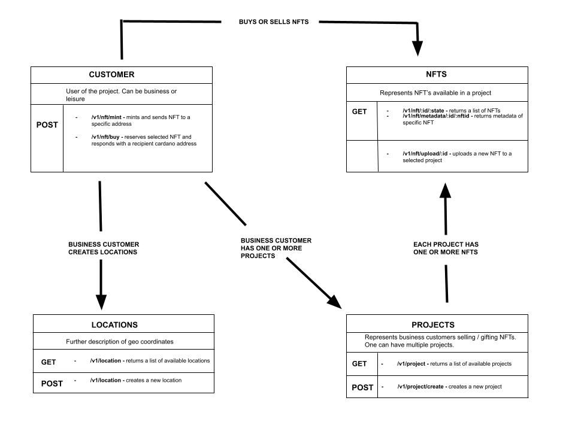

# Token API
Token API service for creating new projects, adding, minting NFT's with extended metadata structure. It also handles buy / sell functionality with media file upload to IPFS.

<p align="center">
  
</p>

### Installation
```
git clone https://github.com/Explory/token-api.git

yarn

mkdir config
touch config/default.json

{
  "NftMaker": {
    "apiKey": "",
    "apiUrl": "https://api.nft-maker.io"
  }
}


yarn build
yarn start

```